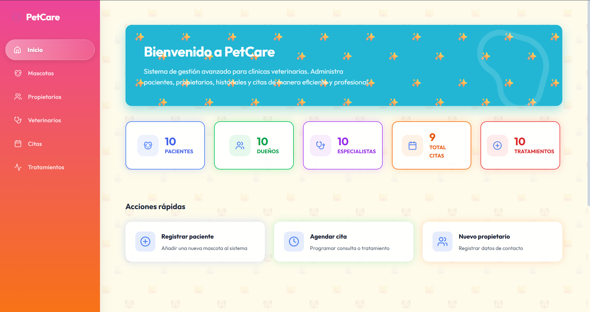
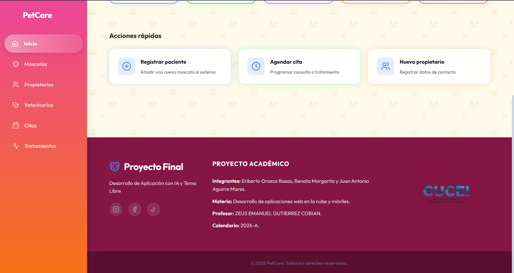
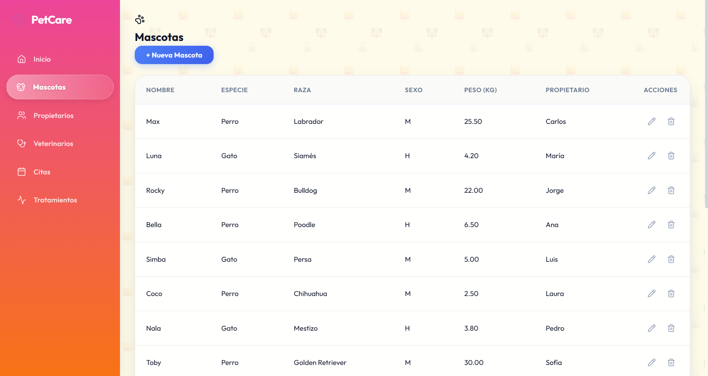
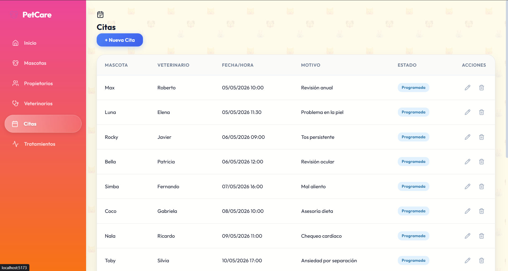

# 🐾 PetCare - Sistema Veterinario PWA Offline-First


CRUD web para la gestión de una clínica veterinaria: mascotas, propietarios, veterinarios, citas y servicios.

Proyecto final de la materia **DESARROLLO DE APLICACIONES WEB EN LA NUBE Y MÓVILES V0749**.

## 🎥 Video demostrativo del proyecto

Puedes ver una demostración completa del funcionamiento del sistema en el siguiente enlace:

👉 [https://youtu.be/TJFvm-GMHKI](https://youtu.be/TJFvm-GMHKI)

## 📋 Índice

- [🐾 PetCare - Sistema Veterinario PWA Offline-First](#-petcare---sistema-veterinario-pwa-offline-first)
  - [🎥 Video demostrativo del proyecto](#-video-demostrativo-del-proyecto)
  - [📋 Índice](#-índice)
  - [Tecnologías](#tecnologías)
  - [Requisitos previos](#requisitos-previos)
  - [Instalación](#instalación)
    - [1. Clonar el repositorio](#1-clonar-el-repositorio)
    - [2. Crear la base de datos](#2-crear-la-base-de-datos)
    - [3. Configurar variables de entorno](#3-configurar-variables-de-entorno)
    - [4. Instalar dependencias](#4-instalar-dependencias)
  - [Ejecución](#ejecución)
  - [Estructura del proyecto](#estructura-del-proyecto)
  - [Base de datos](#base-de-datos)
    - [Constraints utilizados](#constraints-utilizados)
    - [Tipos de datos](#tipos-de-datos)
  - [API REST — Endpoints](#api-rest--endpoints)
  - [Comandos útiles](#comandos-útiles)
  - [Solución de problemas](#solución-de-problemas)
  - [Equipo](#equipo)
  - [Problema o necesidad que resuelve](#problema-o-necesidad-que-resuelve)
  - [Funcionalidades principales](#funcionalidades-principales)
  - [Herramientas de IA utilizadas](#herramientas-de-ia-utilizadas)
  - [Prompts principales o resumen del uso de IA](#prompts-principales-o-resumen-del-uso-de-ia)
  - [Capturas de pantalla o evidencias](#capturas-de-pantalla-o-evidencias)
  - [Conclusiones individuales del equipo](#conclusiones-individuales-del-equipo)

---

## Tecnologías

| Capa | Tecnología |
|------|-----------|
| Frontend | React 19 + TypeScript + Vite |
| Backend | Express 5 + Node.js |
| Base de datos | PostgreSQL |
| Runtime | Bun |
| Estilos | CSS Modules |
| Control de versiones | Git + GitHub |

## Requisitos previos

- [Bun](https://bun.sh/) (v1.1+)
- [PostgreSQL](https://www.postgresql.org/) (v15+)
- Git

## Instalación

### 1. Clonar el repositorio

```bash
git clone https://github.com/tu-usuario/petcare-crud-proyectofinal.git
cd petcare-crud-proyectofinal
```

### 2. Crear la base de datos

Abre una terminal de PostgreSQL (`psql`) y ejecuta:

```sql
CREATE DATABASE petcare;
```

Luego importa el schema y los datos:

```bash
psql -U tu_usuario -d petcare -f sql/schema.sql
psql -U tu_usuario -d petcare -f sql/inserts.sql
```

> Si tienes el respaldo completo en texto plano, también puedes restaurarlo con:
> ```bash
> psql -U tu_usuario -d petcare -f respaldo.sql
> ```

### 3. Configurar variables de entorno

Crea el archivo `server/.env`:

```env
DB_USER=tu_usuario
DB_PASSWORD=tu_contraseña
DB_HOST=localhost
DB_PORT=5432
DB_NAME=petcare
PORT=3000
```

### 4. Instalar dependencias

```bash
# Backend
cd server
bun install

# Frontend
cd ../client
bun install
```

## Ejecución

Necesitas **dos terminales** abiertas al mismo tiempo:

```bash
# Terminal 1 — Backend (API)
cd server
bun run dev
# → Servidor corriendo en http://localhost:3000

# Terminal 2 — Frontend (React)
cd client
bun run dev
# → App disponible en http://localhost:5173
```

Abre [http://localhost:5173](http://localhost:5173) en tu navegador.

## Estructura del proyecto

```
petcare/
├── client/                  ← Frontend (React + TypeScript)
│   ├── src/
│   │   ├── components/      ← Componentes reutilizables (Button, DataTable, Sidebar, etc.)
│   │   ├── hooks/           ← Custom hooks (lógica de CRUD por entidad)
│   │   ├── pages/           ← Páginas (una por entidad)
│   │   ├── services/        ← Llamadas HTTP a la API
│   │   ├── router/          ← Configuración de rutas
│   │   ├── types/           ← Interfaces TypeScript
│   │   ├── App.tsx
│   │   ├── global.css
│   │   └── main.tsx
│   └── package.json
│
├── server/                  ← Backend (API REST)
│   ├── src/
│   │   ├── controllers/     ← Lógica de cada endpoint (queries SQL)
│   │   ├── db/              ← Pool de conexión a PostgreSQL
│   │   ├── routes/          ← Definición de rutas HTTP
│   │   └── index.ts         ← Punto de entrada del servidor
│   ├── .env                 ← Variables de entorno (NO se sube a Git)
│   └── package.json
│
├── sql/                     ← Scripts SQL
│   ├── schema.sql           ← Creación de tablas con constraints
│   └── inserts.sql          ← Datos de prueba (10-20 registros por tabla)
│
└── README.md
```

## Base de datos

La base de datos cuenta con **6 tablas** normalizadas e interrelacionadas:

- **propietarios** — Datos personales de los dueños de mascotas.
- **mascotas** — Información de cada mascota, vinculada a su propietario.
- **veterinarios** — Profesionales que atienden las citas.
- **servicios** — Catálogo de servicios que ofrece la clínica (consulta, vacunación, cirugía, etc.).
- **citas** — Registro de cada visita, relacionando mascota y veterinario.
- **citas_servicios** — Tabla intermedia que implementa la relación **muchos a muchos** entre citas y servicios, almacenando el precio aplicado en cada caso.

### Constraints utilizados

`PRIMARY KEY` · `FOREIGN KEY` (con `ON DELETE RESTRICT`) · `CHECK` · `UNIQUE` · `NOT NULL` · `DEFAULT`

### Tipos de datos

`SERIAL` · `VARCHAR` · `INT` · `NUMERIC` · `DATE` · `TIMESTAMP` · `BOOLEAN` · `TEXT` · `CHAR`

## API REST — Endpoints

Todas las entidades siguen el mismo patrón CRUD:

| Método | Ruta | Acción |
|--------|------|--------|
| `GET` | `/api/{entidad}` | Listar todos los registros |
| `GET` | `/api/{entidad}/:id` | Obtener un registro por ID |
| `POST` | `/api/{entidad}` | Crear un nuevo registro |
| `PUT` | `/api/{entidad}/:id` | Actualizar un registro |
| `DELETE` | `/api/{entidad}/:id` | Eliminar un registro |

Entidades disponibles: `mascotas`, `propietarios`, `veterinarios`, `citas`, `servicios`, `citas-servicios`.

Las consultas `SELECT` utilizan `INNER JOIN` para traer datos relacionados (ej. nombre del propietario al listar mascotas). Se usan consultas parametrizadas (`$1`, `$2`) para prevenir inyección SQL.

## Comandos útiles

| Comando | Ubicación | Descripción |
|---------|-----------|-------------|
| `bun run dev` | `server/` | Arranca el backend en modo desarrollo |
| `bun run dev` | `client/` | Arranca el frontend en modo desarrollo |
| `bun run build` | `client/` | Compila el frontend para producción |
| `bun run lint` | `client/` | Revisa errores con ESLint |
| `bun run format` | `client/` | Formatea el código con Prettier |

## Solución de problemas

**El frontend no carga** — Verifica que ejecutaste `bun install` en `client/` y que el puerto 5173 no esté ocupado.

**Error de conexión a la base de datos** — Revisa que PostgreSQL esté corriendo y que los datos en `server/.env` sean correctos. Asegúrate de que la base de datos `petcare` exista.

**Los datos no aparecen en las tablas** — Verifica que el backend esté corriendo en otra terminal. Revisa la consola del navegador (F12) para ver errores de red.

## Equipo

| Rol | Integrante | Responsabilidades |
|-----|-----------|-------------------|
| Líder de Desarrollo e Interfaz | Juan | Diseño y programación del CRUD web, conexión con PostgreSQL, descripción de la tecnología |
| Especialista en Bases de Datos | Eriberto | Implementación de tablas, scripts SQL, inserción de registros, respaldo |
| Arquitecto y Documentador | Renata | Modelos E-R y Relacional, diccionario de datos, compilación del PDF |

---

## Problema o necesidad que resuelve
Las clínicas veterinarias pequeñas y medianas (PyMES) suelen depender de procesos manuales o de sistemas que requieren 100% de conexión a internet. Esto provoca parálisis operativa, pérdida de historiales clínicos y descontrol de inventario cuando ocurren caídas de red. PetCare resuelve esto centralizando la información mediante una arquitectura que permite seguir operando sin conexión a internet.

## Funcionalidades principales
- **Arquitectura Offline-First:** Operatividad continua mediante PWA y almacenamiento local con IndexedDB.
- **Gestión de Pacientes y Propietarios:** Registro, consulta y edición de información clínica básica y datos de contacto.
- **Módulo de Citas y Expedientes:** Control de la agenda veterinaria y registro de consultas médicas.
- **Sincronización en Segundo Plano:** Sincronización automática con el servidor (PostgreSQL) cuando regresa el internet, usando generación de UUIDs locales y regla de "Last Write Wins".

## Herramientas de IA utilizadas
- **Gemini (Modelo 3.1 Pro):** Se utilizó como asistente principal para la toma de decisiones de arquitectura, validación de código TypeScript/React y estructuración de la documentación técnica.
- **NotebookLM:** Utilizado para analizar los documentos del proyecto y estructurar los guiones para el pitch técnico de defensa.
- **Antygravity:** Utilizada para la edición directa de archivos, revisión, formateo y ajustes generales en la estructura del proyecto.

## Prompts principales o resumen del uso de IA
La IA no se utilizó para generar el proyecto desde cero, sino como apoyo técnico, de edición y validación:
1. **Revisión de Arquitectura de BD:** *"Revisa los diagramas y dime qué haría falta para mi proyecto modular"*. Esto derivó en la recomendación de usar UUIDs v4 generados en el cliente en lugar de IDs seriales para evitar colisiones offline.
2. **Depuración y Edición de Archivos:** Uso de Antygravity para agilizar la modificación de archivos de código y texto. Validación de errores de compilación de Vite en los componentes de UI creados por el equipo (React/Tailwind).
3. **Redacción técnica:** Estructuración de documentos formales como el Software Requirements Specification (SRS), Documento de Diseño (SDD) y guiones de defensa basándose en la información cruda del equipo.

## Capturas de pantalla o evidencias


*Vista principal del sistema y dashboard.*


*Detalle inferior de la vista principal.*


*Gestión de pacientes operando.*


*Control de citas de la clínica.*

## Conclusiones individuales del equipo

- **Juan Antonio (Frontend UI/UX):** Consolidar el sistema de diseño con React y Tailwind CSS fue un paso fundamental. Logramos construir primitivos visuales reutilizables que no solo cumplen con normativas de accesibilidad, sino que brindan una interfaz clara que reduce la fricción al capturar datos en momentos de fallas de red.
- **Renata Margarita (Product Owner / Gestión y Documentación):** El éxito de esta fase radicó en priorizar el alcance del MVP hacia el modelo Offline-First. Adicionalmente, estructurar la documentación técnica en los documentos PDF nos permitió justificar de manera formal nuestras decisiones de arquitectura y mantener al equipo alineado con los requerimientos del cliente piloto.
- **Eriberto Orozco (Backend / Arquitectura y Base de Datos):** Implementar la persistencia dual supuso un gran reto técnico. A través de IndexedDB, la generación de UUIDs nativos y el desarrollo de nuestra API conectada a PostgreSQL, logramos establecer una arquitectura robusta que previene colisiones de datos y garantiza la integridad de la clínica en todo momento.
